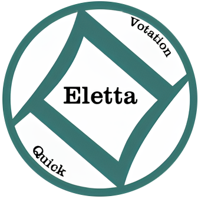

---
hide:
  - navigation
  - toc
---

<!-- HERO SECTION: aparece primeiro -->

  <!-- Fundo animado customizado -->
  

    <canvas id="eletta-particles" style="width:100vw;height:100vh;display:block;"></canvas>
  

  <!-- Banner animado -->
  

    
  

  <h1 align="center" class="eletta-title" style="font-size: 5em; letter-spacing: 5px; background: linear-gradient(90deg,#009688,#673ab7,#ff9800); -webkit-background-clip: text; color: #fff; animation: gradient-move 8s ease-in-out infinite alternate; text-shadow: 0 5px 12px #000a; margin-bottom: 0.4em; margin-top: 1em;">
    Eletta
  </h1>
  

    <b>Aplicativo Android de votações presenciais</b> 
    Transformando decisões em experiências digitais seguras, rápidas e transparentes.
  

  

    
    
    
  

  <!-- Botão de chamada para ação -->

  <!-- Seta para rolar -->
  

    &#8595;
  

<!-- CONTEÚDO PRINCIPAL ESCONDIDO ATÉ ROLAR -->

<!-- ...existing code a partir do próximo conteúdo... -->

  <!-- Caixa de texto -->
  

    

     O Eletta é um <b>aplicativo Android</b> para criar votações locais de forma simples, segura e transparente.
      Ele permite que grupos tomem decisões coletivas, com anonimato e resultados em tempo real.
      <b>Sem necessidade de internet</b>, bastando que todos estejam conectados à mesma rede local.
    

  

  <!-- Layout de telefone com vídeo -->
  

    

      <video autoplay loop muted playsinline style="width:100%; height:100%; object-fit:cover; border-radius:28px;">
        <source src="assets/videos/VideoHost.mp4" type="video/mp4">
        Seu navegador não suporta vídeo HTML5.
      </video>
      <!-- Simula botão home do celular -->
      

    

  

  

    

      <video autoplay loop muted playsinline style="width:100%; height:100%; object-fit:cover; border-radius:28px;">
        <source src="assets/videos/VideoVotante.mp4" type="video/mp4">
        Seu navegador não suporta vídeo HTML5.
      </video>
      <!-- Simula botão home do celular -->
      

    

  

 
<!-- Aqui podemos colocar o APK -->

    <a href="https://github.com/unb-mds/2025-1-Squad06" style="display:inline-block;padding:1em 2.2em;font-size:1.2em;font-weight:bold;color:#fff;background:#39745F;border-radius:40px;box-shadow:0 4px 24px #0003;transition:transform 0.2s;animation:ctaPulse 2.5s infinite alternate;text-decoration:none;">
      ⭐️ Experimente o Eletta agora!
    </a>

 
<h2>🌟 Por que usar o Eletta?</h2>

  

      <h3 style="color:#004d40;" align= "center">🔒 Segurança</h3>
      

        Anonimato garantido, resultados transparentes e integridade dos votos para máxima confiança no processo.
      

  

  

    <h3 style="color:#4527a0;" align= "center">⚡ Rapidez</h3>
    
Resultados instantâneos e interface responsiva para qualquer dispositivo Android.

  

  

    <h3 style="color:#ef6c00;" align= "center">🧩 Flexibilidade</h3>
    
Ideal para empresas, escolas, comunidades e qualquer grupo que precise decidir.

  

 
<h2>👥 Nossa Equipe</h2>
 
<!-- Carrossel de colaboradores (transição slide suave real, mais largo) -->

  

    <button id="collab-prev" style="background: none; border: none; font-size: 2.5em; color: #fff; cursor: pointer; padding: 0 0.5em; border-radius: 50%; transition: background 0.2s;" onmouseover="this.style.background='#e0e0e0';this.style.color='#39745F'" onmouseout="this.style.background='none';this.style.color='#fff'">&#8592;</button>
    

      

        <!-- Cards dos colaboradores via JS -->
      

    

    <button id="collab-next" style="background: none; border: none; font-size: 2.5em; color: #fff; cursor: pointer; padding: 0 0.5em; border-radius: 50%; transition: background 0.2s;" onmouseover="this.style.background='#e0e0e0';this.style.color='#39745F'" onmouseout="this.style.background='none';this.style.color='#fff'">&#8594;</button>
  

  

<!-- ...existing code... -->

  Junte-se a nós e transforme a forma de decidir! 
  © 2025 Eletta &mdash; Licença <a href="https://github.com/unb-mds/2025-1-Eletta/blob/main/LICENSE">MIT</a>

